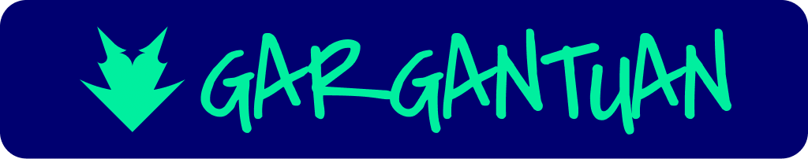
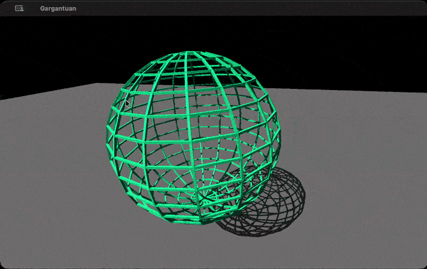
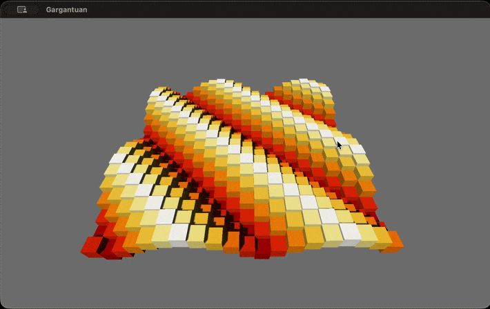

 

<h3>An Independent Game Engine for Roblox Developers</h3>

## About Gargantuan

Gargantuan is an 3D game engine, scriptable using Luau, independently developed
and maintained by Team Fireworks.

- **Gargantuan is powerful,** boasting a feature rich 2D and 3D featureset.
- **Gargantuan is productive,** with a familiar Luau API surface that enables rapid prototyping.
- **Gargantuan is multiplatform,** so one game runs across MacOS, Windows, Linux, mobile, and VR.

And finally,

- **Gargantuan is 100% yours,** from the platform, assets, multiplayer, and even core scripts.

Sparked your interest? [Read the documentation.](./docs/index.md)

## Development

Gargantuan is maintained by [godmothersfire](https://github.com/godmothersfire)
who representes [Team Fireworks](https://github.com/teamfireworks).

Gargantuan is a project by and for the collective Roblox community. Gargantuan
welcomes your contribution and support, even if it's just messing around with
the engine. [We have a contributing guide for those interested!](./CONTRIBUTING.md)

Below is the current status of Gargantuan's development:

### Gargantuan 0.1

### Basics

- [x] Luau runtime layer
- [x] Parts
- [x] Shadows
- [x] RunService
- [x] Workspace
- [x] UserInputService
- [x] Lighting
- [x] TweenInfo

#### Studio

Projects will initially have:

- a `.gargantuan/project.instance.json`
- a `.gargantuan/project.config.json`

Studio progress:

- [x] `.instance.json` format
- [x] Load projects by CLI
- [x] Opens existing projects
- [x] Filelinking (NOTE: needs bugfixes and edge casing for Rojo init.luaus)
- [ ] New project flow
- [ ] Implement UI primitives
- [ ] Widgets
- [ ] Docking
- [ ] Plugins system
- [ ] Ribbon bar
- [ ] Settings plugin
- [ ] Explorer plugin
- [ ] Properties plugin
- [ ] Console plugin
- [ ] Building tool plugin
- [ ] Run Rojo inside Gargantuan :)

#### Scripting

- [ ] ProcessService (great for Lest and friends!)
- [ ] Implement the remaining data types to API parity
- [ ] ScriptSecurity enum, tentatively: None, Plugin, Studio, Internal
- [x] `require()` implementation with user-provided require aliases
- [x] `@game/...` maps to requiring `DataModel...`
- [ ] Implement `@std/test` from Lute
- [ ] Implement the assortment of Lute stdlibs
- [ ] Implement code modifications with `@std/syntax`
- [ ] Implement Roblox-compatibility code modifications (for RBXScriptConnection)

#### UI

- [ ] Render GuiObjects
- [ ] Render Frames
- [ ] Render TextLabels
- [ ] Render ImageLabels
- [ ] UIListLayout and UIFlexItem
- [ ] UICorners, UIGradients, UIPaddings, UIStroke, etc
- [ ] UISizeConstraint, UIGridLayouts, UIPageLayouts etc
- [ ] Render EditableImages
- [ ] TextButtons and ImageButtons receive input
- [ ] TextBoxes are stateful
- [ ] Render ScrollingFrames
- [ ] Drag and drop
- [ ] EditableImages
- [ ] ViewportFrames
- [ ] Stylesheets?

#### World

- [ ] Basic physics colliders
- [ ] Mesh colliders
- [ ] Visual Materials
- [ ] Physical Materials
- [ ] MaterialService
- [ ] PBR
- [ ] LightingService
- [ ] LightingEffects
- [ ] Textures and decals
- [ ] GlslSourceContainer, VertexShader, FragmentShader, ComputeShader classes
- [ ] Competent lighting
- [ ] MVP player controller preset (Exact obbying can be done later)

### Gargantuan 0.2

#### Repository

- [ ] Monorepository layout (Can be done in 0.1 if deemed feasible)
- [ ] Migrate to flecs with an ECS layout (Spook has a reference implementation)

#### Studio

- [ ] `.instance.bin` format
- [ ] Compile projects into executables
- [ ] Implement client-server boundaries (run two Gargantuans at once for now)
- [ ] Datastores
- [ ] Monetization $$$$$$ (by the developer, not Gargantuan)

#### Worlds

- [ ] Constraints
- [ ] ParticleEmitters
- [ ] Trails
- [ ] Beams

### Gargantuan 0.3/1.0

#### Studio

- [ ] Self-hosting game servers
- [ ] Self-hosting CDN servers
- [ ] API rich enough to get large games onto Gargantuan (ie. Welcome To Hell)
- [ ] Visual scripting (block & node based)

## Prior Art

Gargantuan's design were informed by several other game engines:

| Resource                                                            | Info                                                            |
| ------------------------------------------------------------------- | --------------------------------------------------------------- |
| [Kinemium Engine](https://github.com/Qquaded/Kinemium-Engine)       | Initial reference implementation for some datatypes             |
| [Phoenix Engine](https://github.com/PhoenixWhitefire/PhoenixEngine) | Initial reference implementation for Instances and the renderer |
| [Kitbash'd](https://github.com/kitbashd)                            | Previously inspired the renderer, now irrelevant                |
| [Flux](https://github.com/thegalaxydev/flux)                        | Inspired the architecture of instances and userdatas            |
| [Librebox](https://github.com/StayBlue/librebox-demo/)              | Examples to bugtest the Gargantuan engine                       |
| [Roblox Creator Documentation](https://create.roblox.com)           | API design inspirations                                         |

## License

This Source Code Form is subject to the terms of the Mozilla Public
License, v. 2.0. If a copy of the MPL was not distributed with this
file, You can obtain one at http://mozilla.org/MPL/2.0/.

## Legal Notice

Gargantuan is an independent open-source game engine created and maintained by
godmothersfire, who represents Team Fireworks.

Gargantuan is an independent project and is NOT affiliated with, authorized by,
endorsed by, or in any way officially connected with Roblox Corporation.
"Roblox" is a registered trademark of Roblox Corporation.

No reverse engineering, decompilation, or extraction of proprietary binaries,
source code, or assets belonging to Roblox Corporation was performed or utilized
in developing Gargantuan. Gargantuan is built from scratch.

API features such as Instances and data types are implemented solely for
developer familiarity, platform portability, and software interoperability under
applicable fair use law including but not limited to the Copyright Act of 1976,
17 U.S.C. § 107.
